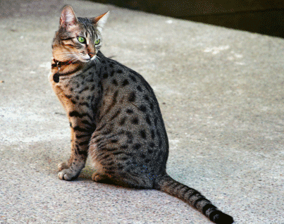

# Vision-Transformer-ViT

La tarea de clasificación se ve enriquecida si además de ello se hace detección de objetos. Esto quiere decir que se ubica el objeto en la imagen. El estado del arte, en este aspecto, lo tenían los modelos compuestos que admitían imágenes y notaciones de ubicación para cada clase. Estos modelos se caracterizan por la velocidad de detección, como __YOLO__ entre las más famosas. Pero los Transformers están cambiando la manera de solucionar este tipo de problema. Este tipo de arquitecturas están constituidas por mapas de atención, también identifican la posición del objetivo a detectar.

Estos modelos son complejos. Inicialmente fueron diseñados para procesamiento de lenguaje, ya que estos mecanismos de atención son más eficientes al entender un conjunto de texto que los modelos basados en redes recurrentes. Por ejemplo:

*El gato era extremadamente gordo, a menudo se comía el alimento de su hermano.*

Para una red recurrente era muy difícil entender quién se comía la comida del hermano.

Los **Transformers**, con los mapas de atención, lo solucionan al generar relaciones entre las palabras o las partes de la imagen.  Entonces, los mapas de atención nos proporcionan las relaciones relevantes entre las palabras y para nuestro caso, la ubicación del objetivo en una imagen.
Lo interesante es que para lograr esto, solo es necesario, identificar la cara, en este caso de un gato. Esto quiere decir que para el modelo las características más relevantes están en su rostro o solo eso requiere para identificarlo. Es muy posible que eso se deba a que el modelo puede clasificar varios tipos de gatos, entre 1000 otras clases más, incluidos otros felinos, animales y otras cosas. Para otros tipos de gatos se activan otras partes de la imagen, no solo el rostro. Y es interesante, también saber que, si usamos un modelo de Transformers más sofisticado, podemos apreciar más partes que se activan en la imagen. Los modelos basados en Transformers, no estaban diseñados para realizar esa tarea, pero sean bienvenidos los casos de uso, que así lo demuestren. Como podemos apreciar en la investigación de [Yuan Gong](https://github.com/YuanGongND/ast) con audio, espectrogramas y Transformers

El código que les comparto está basado en la investigación de [Jacob Gildenblat](https://jacobgil.github.io/deeplearning/vision-transformer-explainability). Que he podido organizar en un [notebook](VIT explicado.ipynb) para tener una mejor experiencia. 

